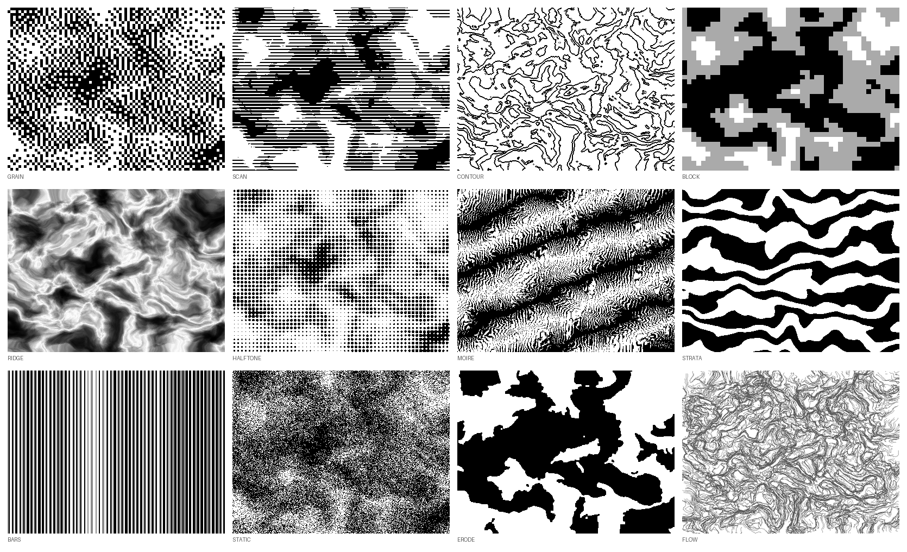

# Inner Field — Archive a Volume

[中文说明](#中文说明) · [English](#english)



---

## 中文说明

一个 Claude skill：把你和 AI 之间一轮日记式对话，排版成一本可以打印的黑白 zine（A4 PDF）。

它不只是一个排版器，更像一个小型出版系统。每一卷都会有：

- 封面：一张由这卷文字本身生成的噪声图（同样的文字永远生成同一张图，改一个字就完全不同）
- 正文：对话原文，一字不改
- 结语：一篇用不同分析视角轮换写成的短文（中文）
- CODA：一首只用这卷里真实出现过的物件写成的英文短诗
- PALETTE：一种颜色和一种气味
- OBJECTS：为你挑选的 3–5 本书 / 专辑 / 电影
- SCRIPT（可选）：把你写成第三人称的一段静止镜头剧本
- 封底：一个留给下一卷的问题

所有生成内容都是黑白灰，只有你自己的照片和截图保留彩色、不加说明。

### 怎么用

**在 claude.ai 网页 / App 上：**

1. 点右上角绿色的 `Code` → `Download ZIP`，下载这个仓库
2. 打开 claude.ai → Settings → Capabilities，确认开启了 Code execution 和 Skills
3. 在 Skills 里点 Upload skill，上传这个 zip
4. 建议在一个 Project 里和 Claude 写日记，一轮结束后说「archive 吧」，并给出卷名（比如 `vol.0 longlong summer`）、贴上这一轮的对话原文、上传你在对话里发过的图片

**在 Claude Code 里：**

```bash
git clone https://github.com/youwyouw/InnerField-diary2zine-tool ~/.claude/skills/inner-field-archive
```

### 小提示

- 结语和推荐书单会参考 Claude 对你的记忆（Memory）。记忆越多，推荐越贴近你。
- SCRIPT 部分默认用「她」指代写日记的人；如果你在对话里写过「他」或别的称呼，Claude 会自动跟随你的用法。
- 你的日记、`vol*.json` 和生成的 PDF 都在 `.gitignore` 里，fork 之后不会被误传到 GitHub。

---

## English

A Claude skill that typesets one round of a private diary conversation as a
printable black-and-white zine, delivered as an A4 PDF.

It is a small publishing system rather than a formatter. Each volume gets a
cover plate generated from its own text, a closing essay written through a
rotating set of analytical lenses, a short poem, a colour-and-smell piece, an
optional film treatment, and a question carried forward to the next volume.

### The noise plate

Two layers. Underneath, a field of layered gradient noise with domain warping,
seeded by the SHA-256 of the volume's title plus its text. On top, one of twelve
renderers. Because the seed is the text itself, a rebuild months later is
pixel-identical, while changing one character anywhere produces a completely
different plate. The renderer rotates by volume number through a fixed shuffled
list, so no two neighbouring volumes share a style and each comes round once
every twelve.

Renderers: `strata` `grain` `flow` `block` `halftone` `ridge` `bars` `contour`
`erode` `moire` `scan` `static`.

### Layout

A4, 12.7mm margins on all four sides, no rules anywhere on the page. Hierarchy
comes from size, weight, grey value, indentation and white space only.

- Chinese body text — Noto Serif CJK SC
- Latin inside body text — Source Serif 4
- Display (cover title, poem, object titles, closing question) — Bodoni Moda
- English section labels — Archivo 700
- Dates and timestamps — IBM Plex Mono

Everything generated is black, white and grey. The only colour is the author's
own photographs and screenshots, which are never converted, never captioned,
and sized to stay legible without swallowing a page.

### Installing

**claude.ai:** download this repo as a ZIP (`Code` → `Download ZIP`), then
upload it under Settings → Capabilities → Skills. Code execution must be on.

**Claude Code:**

```bash
git clone https://github.com/youwyouw/InnerField-diary2zine-tool ~/.claude/skills/inner-field-archive
```

Then, at the end of a round of diary conversation, say "archive" and hand over
a volume title like `vol.0 longlong summer`, the transcript, and any images.

### Running the typesetter directly

```bash
pip install --break-system-packages weasyprint
mkdir -p ~/.fonts && cd ~/.fonts
B="https://raw.githubusercontent.com/google/fonts/main"
curl -sSL -o SourceSerif4.ttf "$B/ofl/sourceserif4/SourceSerif4%5Bopsz,wght%5D.ttf"
curl -sSL -o BodoniModa.ttf   "$B/ofl/bodonimoda/BodoniModa%5Bopsz,wght%5D.ttf"
curl -sSL -o Archivo.ttf      "$B/ofl/archivo/Archivo%5Bwdth,wght%5D.ttf"
curl -sSL -o IBMPlexMono.ttf  "$B/ofl/ibmplexmono/IBMPlexMono-Regular.ttf"
fc-cache -f

cd scripts && python3 zine.py vol.json out.pdf
```

Noto Serif CJK SC is preinstalled on most Linux images; otherwise
`apt-get install fonts-noto-cjk`.

See the `vol.json` section of `SKILL.md` for the input schema.

### Licence

MIT. See `LICENSE`.
